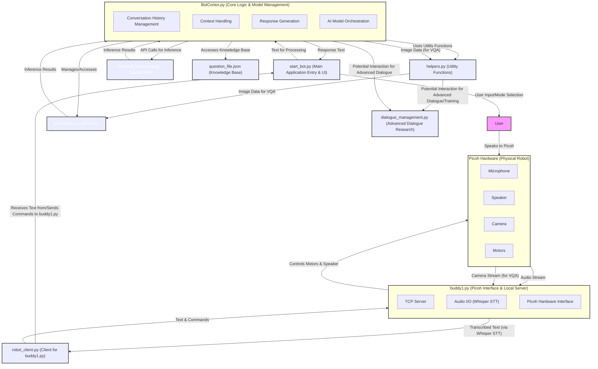
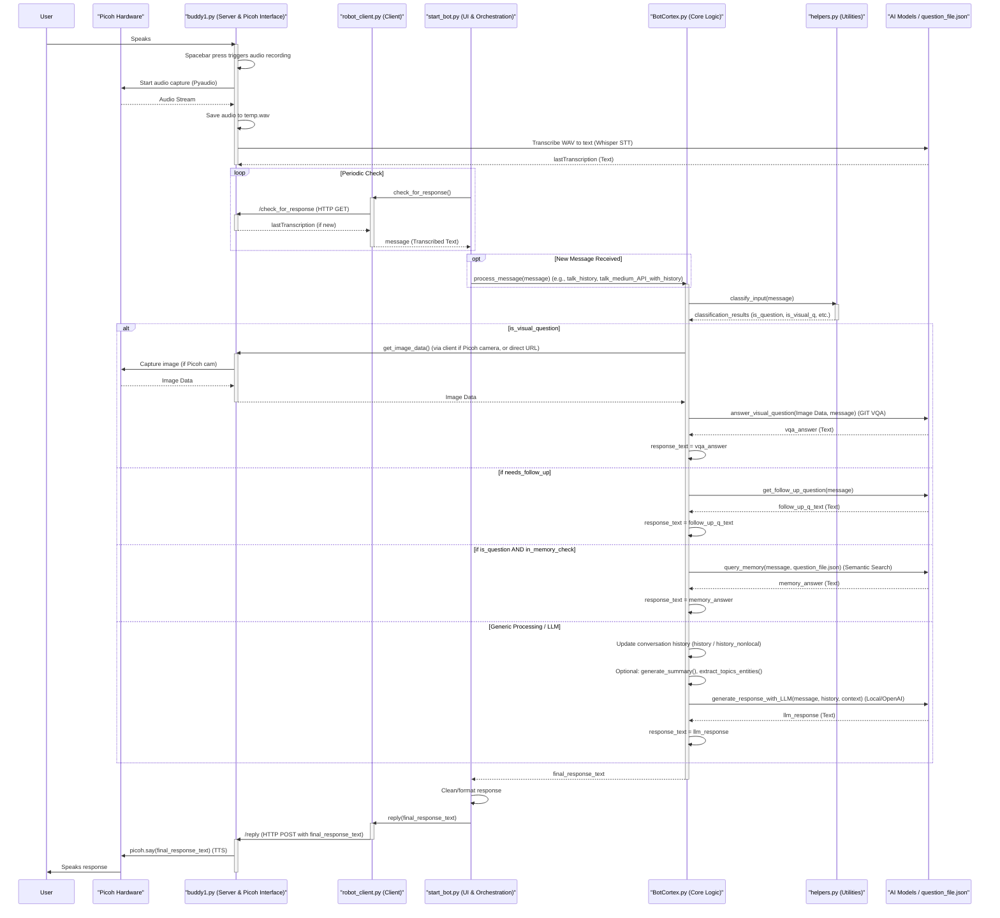

# System Analysis and Diagrams

## High-Level Architecture Diagram


## Dataflow Diagram for Main Conversation Loop


## BotCortex.py - Model Interaction Diagram

```mermaid
graph TD
    Input[("Input Text")] --> MainDispatch{"Main Dispatch Logic (e.g., talk_history, talk_medium_API_with_history)"};

    MainDispatch --> CallClassifyInput["Call helpers.py: classify_input(text)"];
    CallClassifyInput --> IsVisualQ{"is_visual_question()?\n(NLI: valhalla/distilbart-mnli-12-3 or OpenAI)"};

    IsVisualQ -- Yes --> CaptureImage["Image Capture\n(cv.VideoCapture from URL)"];
    CaptureImage --> VQAModel["VQA Model\n(microsoft/git-large-vqav2 via answer_visual_question)"];
    VQAModel --> Output[("Generated Text Response")];

    IsVisualQ -- No --> NeedsFollowUp{"needs_follow_up()?\n(NLI: valhalla/distilbart-mnli-12-3)"};
    NeedsFollowUp -- Yes --> QGenModel["Question Generation Model\n(voidful/context-only-question-generator or OpenAI via get_follow_up_question)"];
    QGenModel --> Output;

    NeedsFollowUp -- No --> IsQuestion{"is_question()?\n(shahrukhx01/question-vs-statement-classifier)"};
    IsQuestion -- Yes --> IsPersonal{"is_personal()?\n(NLI: valhalla/distilbart-mnli-12-3)"};
    
    IsPersonal -- No --> AttemptMemoryQuery["Attempt Memory Query (query_memory)"];
    AttemptMemoryQuery --> LoadJSON["Load question_file.json"];
    LoadJSON --> SentenceTransformer["Sentence Transformer Embeddings\n(sentence-transformers/all-mpnet-base-v2 via get_embeddings)"];
    SentenceTransformer --> SemanticSearch{"Semantic Search: Match Found?"};
    
    SemanticSearch -- Yes --> UseJSONAnswer["Use Answer from JSON"];
    UseJSONAnswer --> Output;

    SemanticSearch -- No --> GeneralProcessingPath{"General Processing / Fallback"};
    IsPersonal -- Yes --> GeneralProcessingPath;
    IsQuestion -- No --> GeneralProcessingPath;

    GeneralProcessingPath --> NER["NER (spacy.load('en_core_web_trf') via find_names)"];
    NER --> Summarization["Summarization (e.g., philschmid/bart-large-cnn-samsum via generate_summary)"];
    Summarization --> TopicExtraction["Topic Extraction (knkarthick/TOPIC-DIALOGSUM via extract_topics)"];
    
    TopicExtraction --> PrepareLLMContext["Prepare LLM Context (History, NER, Summary, Topics)"];
    PrepareLLMContext --> PrimaryLLM["Primary Language Model (LLM)\nLocal: Pygmalion-6B, BlenderBot, DialoGPT\nCloud: OpenAI gpt-3.5-turbo"];
    PrimaryLLM --> Output;

    %% Styling (optional, for clarity)
    classDef model fill:#lightblue,stroke:#333,stroke-width:2px;
    classDef decision fill:#lightgreen,stroke:#333,stroke-width:2px;
    classDef process fill:#orange,stroke:#333,stroke-width:2px;
    classDef io fill:#f9f,stroke:#333,stroke-width:2px;

    class Input,Output io;
    class MainDispatch,CallClassifyInput,AttemptMemoryQuery,LoadJSON,SemanticSearch,UseJSONAnswer,GeneralProcessingPath,CaptureImage,PrepareLLMContext process;
    class IsVisualQ,NeedsFollowUp,IsQuestion,IsPersonal decision;
    class VQAModel,QGenModel,SentenceTransformer,NER,Summarization,TopicExtraction,PrimaryLLM model;
```


## BotCortex.py - Simplified State Diagram
```mermaid
stateDiagram-v2
%% ---- composite states first ---------------------------------
state "Input Received / Classifying" as IRC {
  note right of IRC
    Uses helpers.py for classification:
    • is_visual_question()
    • needs_follow_up()
    • is_question() & is_personal()
  end note
}

state "Processing Visual Question" as PVQ {
  note left of PVQ
    Involves:
    • Image capture (URL or Picoh)
    • VQA model (e.g., GIT)
  end note
}

state "Processing Follow-up Needed" as PFU {
  note right of PFU
    Involves:
    • Question-generation model
  end note
}

state "Processing Memory Query" as PMQ {
  note left of PMQ
    Involves:
    • Semantic search on question_file.json
    • Sentence-Transformer embeddings
  end note
}

state "Processing General Chat (LLM)" as PGC {
  note right of PGC
    Involves:
    • Primary LLM (local or cloud)
    • Context: history, NER, summary, topics
  end note
}
%% --------------------------------------------------------------

[*] --> Idle_AwaitingInput
Idle_AwaitingInput --> IRC : "input text received"

IRC --> PVQ : "Classified: visual"
IRC --> PFU : "Classified: needs follow-up"
IRC --> PMQ : "Classified: memory"
IRC --> PGC : "Classified: general"

PVQ --> GeneratingResponse : "VQA result"
PFU --> GeneratingResponse : "follow-up question"
PMQ --> GeneratingResponse : "found / not found"
PGC --> GeneratingResponse : "LLM output"

GeneratingResponse --> ResponseReady : "response finalised"
ResponseReady --> Idle_AwaitingInput : "response sent"
```

## Key Data Structures
*   **`BotCortex.history`**
    *   **Location:** `BotCortex.py`
    *   **Structure:** List of strings. Each string represents a turn in the conversation, prefixed by "Human: " or "Cooper: ".
    *   **Purpose:** Stores the conversation history for local, non-API based language models. It's used to provide context to the model for generating responses.

*   **`BotCortex.history_nonlocal`**
    *   **Location:** `BotCortex.py`
    *   **Structure:** List of dictionaries. Each dictionary has "role" (e.g., "system", "user", "assistant") and "content" (the text of the turn) keys.
    *   **Purpose:** Stores conversation history formatted for use with OpenAI's ChatCompletion API (e.g., gpt-3.5-turbo). Includes a system message to set the bot's persona.

*   **`question_file.json` content**
    *   **Location:** `question_file.json` (accessed by `BotCortex.py`)
    *   **Structure:** JSON object where keys are questions (strings) and values are their corresponding answers (strings).
    *   **Purpose:** Acts as a knowledge base or memory for the bot. `BotCortex.py` uses semantic search (via `get_embeddings` and `search_question_in_bank`) to find answers to user questions from this file.

*   **`BotCortex.named_entities`**
    *   **Location:** `BotCortex.py`
    *   **Structure:** List of strings.
    *   **Purpose:** Stores named entities (primarily person names) extracted from the conversation by the `find_names` function (using spaCy NER). This list can be used to enhance context or personalize responses.

*   **`BotCortex.important_words`**
    *   **Location:** `BotCortex.py` (Initialized as an empty list, populated by `extract_topics`)
    *   **Structure:** List of strings.
    *   **Purpose:** Stores important words or phrases identified from conversation summaries, potentially used for context or topic tracking.

*   **`start_bot.button_text`**
    *   **Location:** `start_bot.py`
    *   **Structure:** String (e.g., "Fast", "Small", "Medium", "Large").
    *   **Purpose:** Stores the user's selection from the UI for the desired model size/speed. This determines which model initialization function is called in `BotCortex.py`.

*   **`start_bot.local_only`**
    *   **Location:** `start_bot.py`
    *   **Structure:** Boolean.
    *   **Purpose:** Stores the user's UI selection indicating whether to use only local models (True) or allow cloud-based APIs like OpenAI (False).

*   **`BotCortex.ds_config` (DeepSpeed Configuration)**
    *   **Location:** `BotCortex.py` (generated by `dsconfig` function)
    *   **Structure:** Python dictionary. Contains various settings for DeepSpeed, such as `fp16` enabled, `zero_optimization` stage, `offload_param`, `train_batch_size`, etc.
    *   **Purpose:** Configures the DeepSpeed library for optimizing and running large language models, especially for memory efficiency and speed.

*   **`buddy1.lastTranscription`**
    *   **Location:** `buddy1.py`
    *   **Structure:** String.
    *   **Purpose:** Stores the most recent text transcribed from speech input via Whisper STT. This is periodically polled by `robot_client.py` (called from `start_bot.py`).

*   **`buddy1.lastReplyMessage`**
    *   **Location:** `buddy1.py`
    *   **Structure:** String.
    *   **Purpose:** Stores the last message/reply that Picoh spoke, to avoid repeating the same message.

*   **Data exchanged via `robot_client.py` and `buddy1.py` (TCP Server/Client)**
    *   **Location:** `robot_client.py`, `buddy1.py`
    *   **Structure:** Pickled Python dictionaries. The dictionary includes `function_name` (string) and optionally `message` (string) for calls from client to server. The server returns pickled results.
    *   **Purpose:** Facilitates communication between the main application logic (`start_bot.py` via `robot_client.py`) and the Picoh hardware interface server (`buddy1.py`) for actions like getting transcriptions or sending text for Picoh to speak.

*   **`start_bot.message` / `start_bot.user_response`**
    *   **Location:** `start_bot.py`
    *   **Structure:** String.
    *   **Purpose:** Holds the user's transcribed input, retrieved from `buddy1.py`. This is then passed to `BotCortex.py` for processing.

*   **`start_bot.reply`**
    *   **Location:** `start_bot.py`
    *   **Structure:** String.
    *   **Purpose:** Stores the response generated by `BotCortex.py`, which is then sent to `buddy1.py` to be spoken by Picoh.

*   **Classification results from `helpers.py` functions (e.g., `is_visual_question`, `needs_follow_up`)**
    *   **Location:** `BotCortex.py` (results of calls to functions in `helpers.py`)
    *   **Structure:** Boolean values, or sometimes tuples (e.g., `(answer_text, True)` from `classify_input`).
    *   **Purpose:** These boolean flags or simple structures guide the decision-making logic in `BotCortex.py` (e.g., whether to query VQA model, generate a follow-up, or search memory).

*   **Image Data for VQA**
    *   **Location:** `BotCortex.py` (within `answer_visual_question` function)
    *   **Structure:** OpenCV image object (NumPy array from `cam.read()`), then converted to PIL Image object. Processed by `GitProcessor` into `pixel_values` (PyTorch tensor).
    *   **Purpose:** Represents the visual input captured from the camera (or potentially a URL) to be used by the Visual Question Answering model.

*   **`dialogue_management.MyDataset` items**
    *   **Location:** `dialogue_management.py`
    *   **Structure:** Tuples of `(input_tensor, target_tensor)`. Tensors are padded sequences of token IDs.
    *   **Purpose:** Represents paired input-target utterances for training dialogue models, specifically the `HierarchicalMemoryNetwork`. The data is loaded from `training_data.json`.

*   **`dialogue_management.HierarchicalMemoryNetwork.memory`**
    *   **Location:** `dialogue_management.py`
    *   **Structure:** PyTorch `nn.Linear` layer, effectively a tensor representing the memory state.
    *   **Purpose:** Part of the experimental `HierarchicalMemoryNetwork`, this is the learnable memory component used during the model's forward pass to store and recall information over turns in a dialogue.

## Deconstructive Analysis
# Deconstructive Analysis of the Picoh Robot Assistant System

This document provides a deconstructive analysis of the Picoh Robot Assistant system, based on its Python source code and previously generated architectural and flow diagrams.

## 1. Overall System Logic and Functionality

The system aims to provide a voice-interactive robot assistant experience through the Picoh hardware. It achieves this by integrating several key components that handle audio input/output, hardware control, user interface, and sophisticated AI-driven language understanding and response generation.

**Core Operation:**

1.  **Voice Input:** The user interacts by speaking to the Picoh robot. The `buddy1.py` script, running as a server on a machine connected to Picoh (likely a Raspberry Pi or similar), captures audio via PyAudio when the spacebar is pressed.
2.  **Speech-to-Text (STT):** The captured audio (`temp.wav`) is transcribed into text using the Whisper STT model within `buddy1.py`. This transcribed text is stored in the `lastTranscription` variable.
3.  **Client-Server Communication:** `start_bot.py`, the main application entry point with a Tkinter UI, runs `robot_client.py`. The client periodically polls `buddy1.py` (server) for new transcriptions using HTTP GET requests to the `/check_for_response` endpoint.
4.  **Core Logic Processing:** Once `start_bot.py` receives new transcribed text, it passes this message to `BotCortex.py`. `BotCortex.py` is the brain of the system. It:
    *   Uses `helpers.py` to classify the input (e.g., is it a visual question, does it need a follow-up, is it a factual question for memory?).
    *   Based on the classification, it routes the input to the appropriate model or process:
        *   **Visual Question Answering (VQA):** If classified as a visual question, `BotCortex.py` can capture an image (e.g., from a hardcoded camera URL or potentially Picoh's camera via `buddy1.py`) and use a VQA model (like `microsoft/git-large-vqav2`) to answer.
        *   **Memory Query:** If it's a question that might be in its knowledge base, it queries `question_file.json` using semantic search (Sentence Transformers for embeddings).
        *   **Follow-up Question Generation:** If the input is vague, it can generate a clarifying follow-up question using models like `voidful/context-only-question-generator` or OpenAI.
        *   **General Chat/LLM:** For other inputs, it leverages a primary Large Language Model (LLM). It maintains conversation history (`history` for local models, `history_nonlocal` for OpenAI) and can enrich the context with NER (Named Entity Recognition via spaCy), summaries (e.g., `philschmid/bart-large-cnn-samsum`), and topic extraction.
5.  **Response Generation:** The selected AI model generates a text response.
6.  **Text-to-Speech (TTS) & Robot Output:** The response from `BotCortex.py` is sent back to `start_bot.py`, then relayed to `buddy1.py` via an HTTP POST request to the `/reply` endpoint. `buddy1.py` uses Picoh's TTS capabilities (`picoh.say()`) to speak the response. `buddy1.py` also controls Picoh's motor movements (nods, turns, eye movements, lid blinks) to provide a more engaging interaction.

**Major Components & Interactions:**

*   **`Picoh Hardware`**: The physical robot with microphone, speaker, camera (potentially), and motors.
*   **`buddy1.py`**: Acts as a local server and direct interface to the Picoh hardware. Handles audio recording, STT (Whisper), TTS, and motor control. Exposes an HTTP API for interaction.
*   **`robot_client.py`**: A client that communicates with `buddy1.py`'s HTTP server to send commands (like text to speak) and retrieve data (like transcribed user speech).
*   **`start_bot.py`**: The main application entry point. Provides a simple Tkinter UI for selecting model size and local/API mode. Orchestrates the flow between `robot_client.py` (and thus `buddy1.py`) and `BotCortex.py`.
*   **`BotCortex.py`**: The core AI logic unit. Manages various AI models, conversation history, context, and decision-making for response generation.
*   **`helpers.py`**: Contains utility functions for input classification (e.g., `is_question`, `is_visual_question`, `needs_follow_up`) using smaller, specialized models (mostly NLI classifiers).
*   **`AI Models (Local/Cloud)`**: A suite of models including STT (Whisper), various LLMs (Pygmalion, DialoGPT, BlenderBot, OpenAI GPT-3.5), VQA models, summarization models, question generation models, NER models, and sentence transformers for semantic search.
*   **`question_file.json`**: A JSON file acting as a persistent knowledge base.
*   **`dialogue_management.py`**: (Currently seems experimental) Contains code for more advanced dialogue models like `HierarchicalMemoryNetwork`, suggesting research into structured dialogue and memory.

**Modes of Operation:**

*   **Local vs. API:**
    *   **Local:** The system can run entirely with locally hosted models (selected via `local_only = True` in `start_bot.py`). This avoids reliance on external APIs and associated costs/latency but requires significant local compute resources.
    *   **API:** The system can use cloud-based APIs (e.g., OpenAI GPT-3.5 for primary chat, potentially others for NLI tasks if `local_only = False`). This offers access to powerful models without local hardware constraints but introduces dependency on internet connectivity and API costs.
*   **Model Sizes ("Fast", "Small", "Medium", "Large"):**
    *   The UI in `start_bot.py` allows users to select a model size. This choice dictates which specific LLM is loaded in `BotCortex.py` (e.g., DialoGPT for "Fast", Pygmalion-350M for "Medium" local, Pygmalion-6B for "Large" local, or GPT-3.5-turbo for "Medium" API). This allows users to trade off between response quality, speed, and resource consumption.

## 2. Strengths of the System

*   **Modularity:** There's a good separation of concerns:
    *   `buddy1.py` encapsulates hardware interactions.
    *   `BotCortex.py` handles the core AI logic.
    *   `start_bot.py` manages the UI and high-level orchestration.
    *   `helpers.py` provides discrete classification utilities.
    This modularity makes the system easier to understand, maintain, and potentially extend.
*   **Comprehensive Model Usage:** The system leverages a wide array of AI models tailored for specific tasks: STT, multiple LLMs for dialogue, VQA, summarization, question generation, NER, NLI for classification, and sentence transformers for semantic search. This allows for a rich set of capabilities.
*   **Flexibility in Model Choice:** The ability to switch between local and cloud-based models, and to select different model sizes, provides significant flexibility for users with varying hardware capabilities, internet access, and performance requirements.
*   **Incorporation of VQA and Memory:**
    *   The VQA capability allows the robot to respond to questions about its visual environment, making the interaction more grounded.
    *   The `question_file.json` combined with semantic search provides a persistent memory, allowing the bot to recall previously learned information.
*   **Use of Advanced Tools:** The system attempts to use DeepSpeed and Accelerate, which are essential for managing and running larger language models efficiently by handling aspects like model parallelism, offloading, and mixed-precision training/inference.
*   **Physical Embodiment:** The integration with the Picoh robot (voice output, motor movements for nodding, turning, blinking) makes the assistant more engaging and lifelike compared to a purely text-based chatbot.
*   **Contextual Understanding:** Attempts to enhance context through conversation history, NER, summarization, and topic extraction before feeding input to the LLM.

## 3. Potential Weaknesses/Areas for Improvement

*   **Complexity:**
    *   **Model Management:** The sheer number of models, their different initialization routines (`load_all_models`), and interdependencies (e.g., `BotCortex.py` relying on specific models in `helpers.py`) make the system complex to manage, debug, and deploy. Resource contention (GPU memory, CPU) is a high probability.
    *   **Orchestration:** The flow of data and control through multiple scripts and asynchronous calls can be hard to trace.
*   **Error Handling:**
    *   While some `try-except` blocks are present (e.g., in `answer_visual_question`, `buddy1.py`'s server loop), error handling could be more comprehensive. Failures in model loading (which can be slow and memory-intensive), API timeouts, or unexpected model outputs might not be gracefully handled across all parts of the system. Specific fallback strategies for model failures could be beneficial.
*   **`dialogue_management.py` Integration:**
    *   Its current role is ambiguous. It defines sophisticated neural network architectures (like `HierarchicalMemoryNetwork`) and a `Dataset` class for `training_data.json`, but it's not clear if or how these are actively used by the main conversational loop in `BotCortex.py` or `start_bot.py`. It appears to be an experimental or future development area.
*   **Configuration Management:**
    *   Model paths (e.g., `"./checkpoint"` for the large GPT-J model, various Hugging Face model names), DeepSpeed configurations, and other settings are often hardcoded or spread across different files. A centralized configuration file or system (e.g., YAML, .env extensions beyond just API key) could improve maintainability and ease of deployment.
*   **VQA Camera Source:** The camera URL `http://192.168.0.191:56000/mjpeg` in `BotCortex.answer_visual_question` is hardcoded. This makes the VQA feature highly dependent on a specific network setup and camera, limiting portability. It should ideally be configurable or discoverable.
*   **Testing:** No explicit unit tests or integration tests (e.g., using `pytest` or `unittest`) are visible in the provided files. This makes it difficult to verify the correctness of individual components or the system as a whole, especially when making changes.
*   **Scalability of `question_file.json`:** While semantic search is more advanced than exact matching, relying on a single, growing JSON file for knowledge storage can become cumbersome to manage, edit, and version. For larger knowledge bases, a more robust database solution (vector database or document store) might be needed.
*   **State Management in `BotCortex.py`:** The current state (e.g., `after_first`, `after_second` flags, `unfound_answer`, `asked_follow_up`) is managed with simple boolean flags. While functional for the current scope, more complex, multi-turn interactions or dialogue goals might require a more formalized state machine or dialogue state tracker. The generated state diagram provides a good overview but the implementation relies on conditional logic that could become complex.
*   **Hardcoded Elements in Prompts/History:** The initial persona (`history_nonlocal[0]`, `first_prompt` in `BotCortex.py`) is hardcoded. While this sets a consistent character, making it configurable would be more flexible. Some example interactions within prompts (e.g., in `is_visual_q`) are also hardcoded.
*   **Resource Initialization:** `load_all_models` in `BotCortex.py` loads many models sequentially, which can be very time-consuming at startup. Some models might only be needed for specific modes, suggesting potential for on-demand loading.
*   **Asynchronous Operations:** The mix of `asyncio` in different parts of the system (`buddy1.py`, `BotCortex.py` model loading, `start_bot.py` main loop) with threading (`buddy1.py` initially, though later refactored to `asyncio` tasks) can be complex. Ensuring all I/O operations are truly non-blocking and that tasks are managed correctly is crucial.

## 4. Role and Potential of `dialogue_management.py`

**Current Contents:**

`dialogue_management.py` currently defines several complex neural network architectures:

*   **`MemoryNetwork`**: A basic network with an explicit memory component and a controller (LSTM).
*   **`HierarchicalEncoderDecoder`**: An LSTM-based model for encoding utterances at a lower level and dialogue structure at a higher level.
*   **`GraphNetwork`**: A network designed to operate on graph-structured data, using message-passing between nodes.
*   **`HierarchicalMemoryNetwork` (HMN)**: Combines hierarchical encoding with a memory component. This seems to be the most developed one, with a `MyDataset` class designed to load data from `training_data.json` and a `TrainingLoop` class.
*   **`GraphMemoryNetwork` and `HierarchicalGraphMemoryNetwork`**: Extensions combining graph processing with memory.

It also includes a `MyDataset` class that processes `training_data.json` (which seems to contain pairs of "Input (from Emma)" and "Target (from Picoh)" strings) into tokenized tensors suitable for training these PyTorch models. A basic `TrainingLoop` class is set up to train the `HierarchicalMemoryNetwork`.

**Speculated Intended Purpose:**

Given the architectures and the training setup, `dialogue_management.py` appears to be a research or experimental module focused on:

1.  **Advanced Dialogue State Tracking:** The hierarchical and memory-based models suggest an attempt to go beyond simple conversation history lists and capture a more nuanced understanding of the dialogue's progression and context.
2.  **Long-Term Memory and Learning:** The memory components in these networks are likely intended to provide a more integrated and learnable form of memory than the `question_file.json` lookup. Instead of just retrieving pre-defined answers, these models might learn to store and recall information dynamically.
3.  **Learning Conversational Strategies:** By training on dialogue data, the system might be intended to learn more complex conversational behaviors, such as how to ask relevant follow-up questions, maintain topics, or manage conversational flow more naturally.
4.  **Handling Complex Dependencies:** Graph-based networks could be an exploration into modeling more complex relationships between concepts or turns in a conversation.

**Potential Integration and Benefits:**

If fully developed and integrated, the models from `dialogue_management.py` could offer significant benefits:

1.  **Improved Contextual Understanding:** An HMN, for instance, could maintain a richer, vector-based representation of the dialogue history and its hierarchical structure, leading to more contextually appropriate responses, especially in long and complex conversations.
2.  **More Dynamic and Adaptive Memory:** Instead of relying solely on `question_file.json`, a trained memory network could learn to store salient information from the ongoing conversation and use it to inform future responses. This could allow the bot to learn from interactions.
3.  **Enhanced Proactivity and Engagement:** Models trained on dialogue strategies could enable the bot to be more proactive, ask more insightful questions, and guide conversations in a more engaging manner, moving beyond simple question-answering.
4.  **Personalization:** A learnable memory could potentially store user preferences or facts about the user learned over time, leading to a more personalized interaction.
5.  **Reduced Reliance on Many Small Models:** A single, powerful dialogue model with integrated memory and context handling might eventually replace some of the smaller, specialized models used in `helpers.py` for classification, leading to a less fragmented system.

However, integrating such models would also present challenges:
*   **Training Data:** Requires substantial amounts of high-quality dialogue data.
*   **Computational Resources:** These models are likely to be computationally expensive for both training and inference.
*   **Complexity:** Integrating and debugging these advanced models within the existing system would be a complex task.

Currently, it seems `dialogue_management.py` is a standalone experimental module rather than an actively integrated part of the main chatbot's operational flow.
