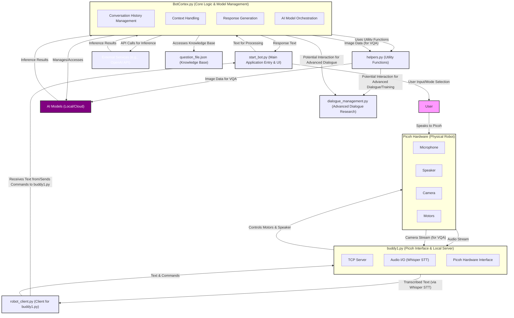

```mermaid
graph TD
    User["User"] -- "Speaks to Picoh" --> Picoh_HW["Picoh Hardware (Physical Robot)"]
    Picoh_HW -- "Audio Stream" --> buddy1_py["buddy1.py (Picoh Interface & Local Server)"]
    Picoh_HW -- "Camera Stream (for VQA)" --> buddy1_py
    buddy1_py -- "Controls Motors & Speaker" --> Picoh_HW
    buddy1_py -- "Transcribed Text (via Whisper STT)" --> robot_client_py["robot_client.py (Client for buddy1.py)"]
    robot_client_py -- "Text & Commands" --> buddy1_py
    robot_client_py -- "Receives Text from/Sends Commands to buddy1.py" --> start_bot_py["start_bot.py (Main Application Entry & UI)"]
    start_bot_py -- "User Input/Mode Selection" --> User
    start_bot_py -- "Text for Processing" --> BotCortex_py["BotCortex.py (Core Logic & Model Management)"]
    BotCortex_py -- "Response Text" --> start_bot_py
    BotCortex_py -- "Uses Utility Functions" --> helpers_py["helpers.py (Utility Functions)"]
    BotCortex_py -- "Manages/Accesses" --> AI_Models["AI Models (Local/Cloud)"]
    AI_Models -- "Inference Results" --> BotCortex_py
    BotCortex_py -- "API Calls for Inference" --> External_Services["External Services (e.g., OpenAI API)"]
    External_Services -- "Inference Results" --> BotCortex_py
    BotCortex_py -- "Accesses Knowledge Base" --> question_file_json["question_file.json (Knowledge Base)"]
    BotCortex_py -- "Image Data (for VQA)" --> helpers_py
    helpers_py -- "Image Data for VQA" --> AI_Models
    BotCortex_py -- "Potential Interaction for Advanced Dialogue" --> dialogue_management_py["dialogue_management.py (Advanced Dialogue Research)"]
    helpers_py -- "Potential Interaction for Advanced Dialogue/Training" --> dialogue_management_py

    subgraph Picoh_HW ["Picoh Hardware (Physical Robot)"]
        direction LR
        Mic["Microphone"]
        Speaker["Speaker"]
        Camera["Camera"]
        Motors["Motors"]
    end

    subgraph buddy1_py ["buddy1.py (Picoh Interface & Local Server)"]
        direction TB
        TCP_Server["TCP Server"]
        Audio_IO["Audio I/O (Whisper STT)"]
        HW_Interface["Picoh Hardware Interface"]
    end

    subgraph BotCortex_py ["BotCortex.py (Core Logic & Model Management)"]
        direction TB
        ConversationManager["Conversation History Management"]
        ContextManager["Context Handling"]
        ResponseGenerator["Response Generation"]
        ModelOrchestrator["AI Model Orchestration"]
    end

    style User fill:#f9f,stroke:#333,stroke-width:2px
    style Picoh_HW fill:#lightgrey,stroke:#333,stroke-width:2px
    style buddy1_py fill:#lightblue,stroke:#333,stroke-width:2px
    style robot_client_py fill:#cyan,stroke:#333,stroke-width:2px
    style start_bot_py fill:#lightgreen,stroke:#333,stroke-width:2px
    style BotCortex_py fill:#orange,stroke:#333,stroke-width:2px
    style helpers_py fill:#yellow,stroke:#333,stroke-width:2px
    style AI_Models fill:#800080,stroke:#333,stroke-width:2px,color:white
    style External_Services fill:#red,stroke:#333,stroke-width:2px,color:white
    style question_file_json fill:#pink,stroke:#333,stroke-width:2px
    style dialogue_management_py fill:#beige,stroke:#333,stroke-width:2px
```
