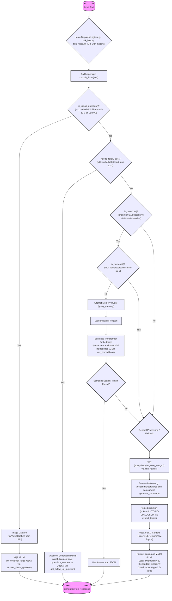

```mermaid
graph TD
    Input[("Input Text")] --> MainDispatch{"Main Dispatch Logic (e.g., talk_history, talk_medium_API_with_history)"};

    MainDispatch --> CallClassifyInput["Call helpers.py: classify_input(text)"];
    CallClassifyInput --> IsVisualQ{"is_visual_question()?\n(NLI: valhalla/distilbart-mnli-12-3 or OpenAI)"};

    IsVisualQ -- Yes --> CaptureImage["Image Capture\n(cv.VideoCapture from URL)"];
    CaptureImage --> VQAModel["VQA Model\n(microsoft/git-large-vqav2 via answer_visual_question)"];
    VQAModel --> Output[("Generated Text Response")];

    IsVisualQ -- No --> NeedsFollowUp{"needs_follow_up()?\n(NLI: valhalla/distilbart-mnli-12-3)"};
    NeedsFollowUp -- Yes --> QGenModel["Question Generation Model\n(voidful/context-only-question-generator or OpenAI via get_follow_up_question)"];
    QGenModel --> Output;

    NeedsFollowUp -- No --> IsQuestion{"is_question()?\n(shahrukhx01/question-vs-statement-classifier)"};
    IsQuestion -- Yes --> IsPersonal{"is_personal()?\n(NLI: valhalla/distilbart-mnli-12-3)"};
    
    IsPersonal -- No --> AttemptMemoryQuery["Attempt Memory Query (query_memory)"];
    AttemptMemoryQuery --> LoadJSON["Load question_file.json"];
    LoadJSON --> SentenceTransformer["Sentence Transformer Embeddings\n(sentence-transformers/all-mpnet-base-v2 via get_embeddings)"];
    SentenceTransformer --> SemanticSearch{"Semantic Search: Match Found?"};
    
    SemanticSearch -- Yes --> UseJSONAnswer["Use Answer from JSON"];
    UseJSONAnswer --> Output;

    SemanticSearch -- No --> GeneralProcessingPath{"General Processing / Fallback"};
    IsPersonal -- Yes --> GeneralProcessingPath;
    IsQuestion -- No --> GeneralProcessingPath;

    GeneralProcessingPath --> NER["NER (spacy.load('en_core_web_trf') via find_names)"];
    NER --> Summarization["Summarization (e.g., philschmid/bart-large-cnn-samsum via generate_summary)"];
    Summarization --> TopicExtraction["Topic Extraction (knkarthick/TOPIC-DIALOGSUM via extract_topics)"];
    
    TopicExtraction --> PrepareLLMContext["Prepare LLM Context (History, NER, Summary, Topics)"];
    PrepareLLMContext --> PrimaryLLM["Primary Language Model (LLM)\nLocal: Pygmalion-6B, BlenderBot, DialoGPT\nCloud: OpenAI gpt-3.5-turbo"];
    PrimaryLLM --> Output;

    %% Styling (optional, for clarity)
    classDef model fill:#lightblue,stroke:#333,stroke-width:2px;
    classDef decision fill:#lightgreen,stroke:#333,stroke-width:2px;
    classDef process fill:#orange,stroke:#333,stroke-width:2px;
    classDef io fill:#f9f,stroke:#333,stroke-width:2px;

    class Input,Output io;
    class MainDispatch,CallClassifyInput,AttemptMemoryQuery,LoadJSON,SemanticSearch,UseJSONAnswer,GeneralProcessingPath,CaptureImage,PrepareLLMContext process;
    class IsVisualQ,NeedsFollowUp,IsQuestion,IsPersonal decision;
    class VQAModel,QGenModel,SentenceTransformer,NER,Summarization,TopicExtraction,PrimaryLLM model;
```
