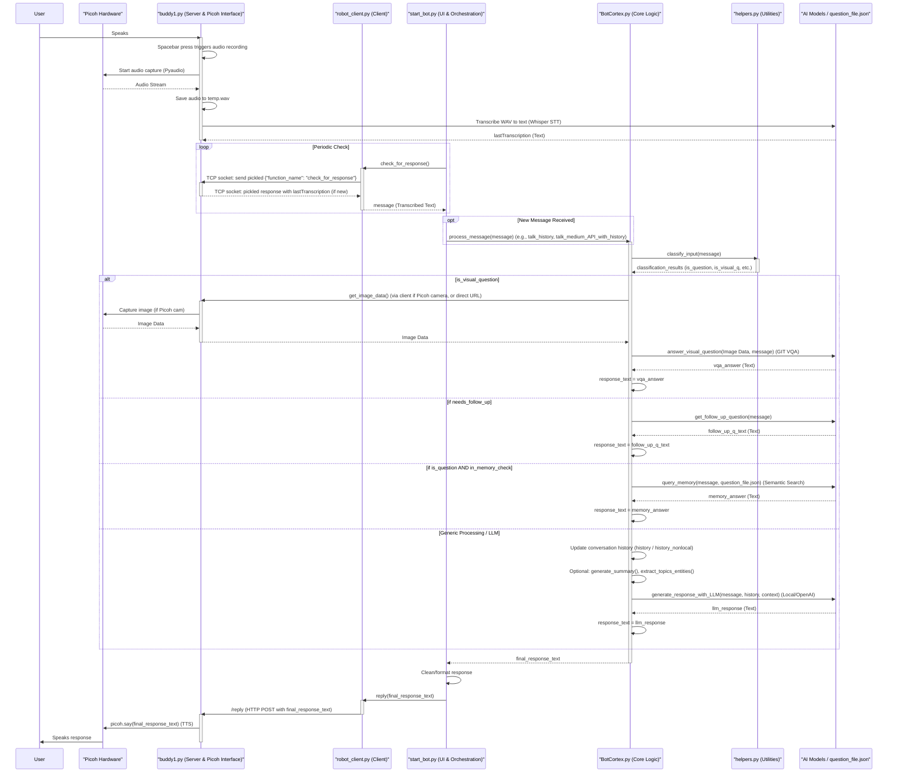

```mermaid
sequenceDiagram
    participant User
    participant PicohHW as "Picoh Hardware"
    participant buddy1 as "buddy1.py (Server & Picoh Interface)"
    participant client as "robot_client.py (Client)"
    participant start_bot as "start_bot.py (UI & Orchestration)"
    participant cortex as "BotCortex.py (Core Logic)"
    participant helpers as "helpers.py (Utilities)"
    participant AIML_KB as "AI Models / question_file.json"

    %% 1. User Speech Input
    User->>buddy1: Speaks
    activate buddy1
    buddy1->>buddy1: Spacebar press triggers audio recording
    buddy1->>PicohHW: Start audio capture (Pyaudio)
    PicohHW-->>buddy1: Audio Stream
    buddy1->>buddy1: Save audio to temp.wav
    buddy1->>AIML_KB: Transcribe WAV to text (Whisper STT)
    AIML_KB-->>buddy1: lastTranscription (Text)
    deactivate buddy1

    %% 2. Text Input Retrieval & Processing
    loop Periodic Check
        start_bot->>client: check_for_response()
        activate client
        client->>buddy1: TCP socket: send pickled {"function_name": "check_for_response"}
        activate buddy1
        buddy1-->>client: TCP socket: pickled response with lastTranscription (if new)
        deactivate buddy1
        client-->>start_bot: message (Transcribed Text)
        deactivate client
    end
    opt New Message Received
        start_bot->>cortex: process_message(message) (e.g., talk_history, talk_medium_API_with_history)
        activate cortex
    end

    %% 3. Core Logic in BotCortex.py
    cortex->>helpers: classify_input(message)
    activate helpers
    helpers-->>cortex: classification_results (is_question, is_visual_q, etc.)
    deactivate helpers

    alt is_visual_question
        cortex->>buddy1: get_image_data() (via client if Picoh camera, or direct URL)
        activate buddy1
        buddy1->>PicohHW: Capture image (if Picoh cam)
        PicohHW-->>buddy1: Image Data
        buddy1-->>cortex: Image Data
        deactivate buddy1
        cortex->>AIML_KB: answer_visual_question(Image Data, message) (GIT VQA)
        AIML_KB-->>cortex: vqa_answer (Text)
        cortex->>cortex: response_text = vqa_answer
    else if needs_follow_up
        cortex->>AIML_KB: get_follow_up_question(message)
        AIML_KB-->>cortex: follow_up_q_text (Text)
        cortex->>cortex: response_text = follow_up_q_text
    else if is_question AND in_memory_check
        cortex->>AIML_KB: query_memory(message, question_file.json) (Semantic Search)
        AIML_KB-->>cortex: memory_answer (Text)
        cortex->>cortex: response_text = memory_answer
    else Generic Processing / LLM
        cortex->>cortex: Update conversation history (history / history_nonlocal)
        cortex->>cortex: Optional: generate_summary(), extract_topics_entities()
        cortex->>AIML_KB: generate_response_with_LLM(message, history, context) (Local/OpenAI)
        AIML_KB-->>cortex: llm_response (Text)
        cortex->>cortex: response_text = llm_response
    end

    %% 4. Response Delivery & Output
    cortex-->>start_bot: final_response_text
    deactivate cortex
    start_bot->>start_bot: Clean/format response
    start_bot->>client: reply(final_response_text)
    activate client
    client->>buddy1: /reply (HTTP POST with final_response_text)
    deactivate client
    activate buddy1
    buddy1->>PicohHW: picoh.say(final_response_text) (TTS)
    PicohHW->>User: Speaks response
    deactivate buddy1

```
